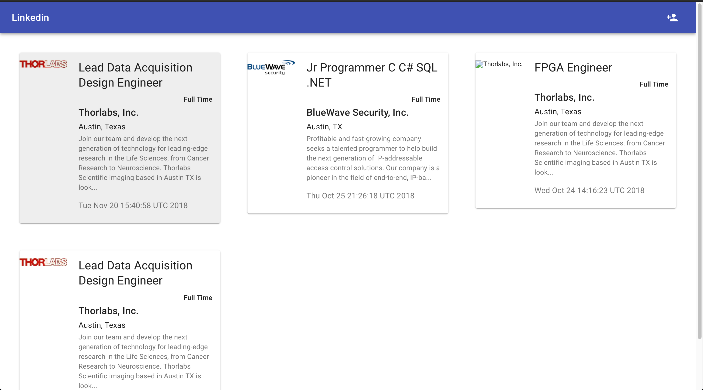

# Job Recommending System Web application

This project is a front end of a job recommending system, another front 
end is an [Android application](https://github.com/GGtray/FlagCampAndroid).

## Navigation
- Login page: allow user to register and then login to the website

- the main panel page: show the recommended job list

- profile page: allow users to upload their preference on location or job description

## Design tool
The project is developed under the React JS framework. Component is comming from Matrerial UI

 
 ## Backend service
 the backend is using Google Firebase Realtime database
 
 
 
 it has extermely well performance and AsynTask feature
 
## How to Use It
run the following shell command in terminal.

`git clone https://github.com/GGtray/FlagCampWeb.git`
`npm install`  
`npm start`

Open [http://localhost:3000](http://localhost:3000) to view it in the browser.
